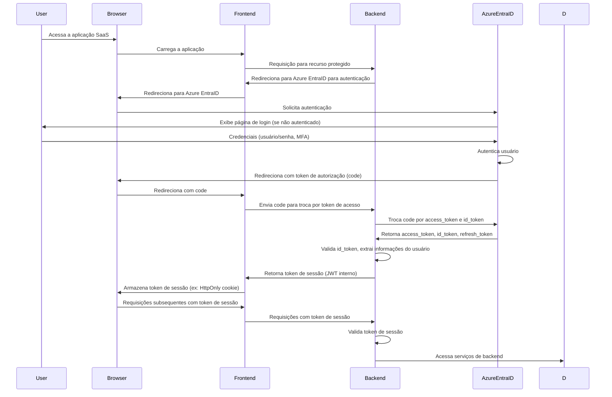

# Sistema SaaS de Automação de Respostas a RFPs

**Autor:** Manus AI  
**Data:** 23 de julho de 2025  
**Versão:** 1.0

## Sumário

1. [Visão Geral e Justificativa](#1-visão-geral-e-justificativa)
2. [Especificação de Arquitetura](#2-especificação-de-arquitetura)
3. [Modelagem de Dados](#3-modelagem-de-dados)
4. [Stack Tecnológica e Justificativas](#4-stack-tecnológica-e-justificativas)
5. [Desenvolvimento de Funcionalidades](#5-desenvolvimento-de-funcionalidades)
6. [Configuração, Deploy e Segurança](#6-configuração-deploy-e-segurança)
7. [Testes e Qualidade](#7-testes-e-qualidade)
8. [Documentação do Usuário/Desenvolvedor](#8-documentação-do-usuáriodesenvolvedora)
9. [Licenciamento](#9-licenciamento)

---


## 1. Visão Geral e Justificativa

### 1.1 Propósito do Sistema

O sistema SaaS de automação de respostas a RFPs (Request for Proposals) representa uma solução inovadora para organizações que enfrentam o desafio constante de responder a múltiplas solicitações de propostas de forma eficiente e consistente. Este sistema foi concebido para transformar o processo tradicionalmente manual e demorado de elaboração de respostas a RFPs em um fluxo automatizado, inteligente e colaborativo.

A plataforma utiliza tecnologias de inteligência artificial de última geração para analisar documentos de RFP, extrair perguntas relevantes, e gerar respostas personalizadas baseadas no conhecimento organizacional previamente indexado. O sistema não apenas acelera o processo de resposta, mas também garante maior consistência, qualidade e conformidade com os requisitos específicos de cada solicitação.

### 1.2 Diferenciais Tecnológicos

#### 1.2.1 Google Gemini API como Motor Principal

A escolha da Google Gemini API como motor principal de inteligência artificial representa um diferencial estratégico significativo. O Gemini oferece capacidades multimodais avançadas, permitindo o processamento não apenas de texto, mas também de imagens, tabelas e outros elementos visuais comumente encontrados em documentos de RFP. Suas principais vantagens incluem:

**Compreensão Contextual Avançada:** O Gemini demonstra capacidade superior na compreensão de contextos complexos e nuances linguísticas, essencial para interpretar corretamente os requisitos específicos de cada RFP. Sua arquitetura permite uma análise mais profunda do conteúdo, identificando não apenas perguntas explícitas, mas também requisitos implícitos e critérios de avaliação subjacentes.

**Processamento Multimodal:** Diferentemente de modelos puramente textuais, o Gemini pode processar documentos que contêm elementos visuais, gráficos, tabelas e diagramas, proporcionando uma análise mais completa e precisa dos documentos de RFP. Esta capacidade é particularmente valiosa em RFPs técnicos que frequentemente incluem especificações visuais e diagramas arquiteturais.

**Geração de Respostas Estruturadas:** O modelo excele na geração de respostas bem estruturadas, mantendo consistência de formato e estilo, aspectos cruciais para a apresentação profissional de propostas. A capacidade de seguir templates e diretrizes específicas garante que as respostas geradas atendam aos padrões organizacionais estabelecidos.

#### 1.2.2 Gemma 3n como Sistema de Fallback e Contextualização

A integração do Gemma 3n como sistema de fallback e contextualização adiciona uma camada robusta de redundância e especialização ao sistema. Esta abordagem híbrida oferece várias vantagens:

**Redundância Operacional:** Em cenários onde a Gemini API pode estar indisponível ou apresentar latência elevada, o Gemma 3n garante a continuidade operacional do sistema. Esta redundância é essencial para organizações que dependem de prazos rígidos para submissão de propostas.

**Especialização Contextual:** O Gemma 3n pode ser fine-tuned para domínios específicos ou tipos particulares de RFP, oferecendo respostas mais especializadas em áreas técnicas específicas. Esta especialização complementa a versatilidade do Gemini, criando um sistema mais robusto e adaptável.

**Otimização de Custos:** A utilização estratégica do Gemma 3n para tarefas específicas pode resultar em otimização significativa de custos operacionais, especialmente em cenários de alto volume de processamento.

#### 1.2.3 Azure EntraID para Autenticação Empresarial

A integração com Azure EntraID (anteriormente Azure Active Directory) estabelece um padrão empresarial de segurança e gestão de identidades. Esta escolha oferece benefícios substanciais:

**Single Sign-On (SSO) Empresarial:** A implementação de SSO através do Azure EntraID elimina a necessidade de credenciais adicionais, simplificando o acesso para usuários corporativos e reduzindo riscos de segurança associados à gestão de múltiplas senhas.

**Gestão Centralizada de Identidades:** Organizações podem aproveitar suas políticas existentes de gestão de identidades, incluindo controles de acesso baseados em função (RBAC), políticas de conformidade e auditoria centralizada.

**Segurança Avançada:** O Azure EntraID oferece recursos avançados de segurança, incluindo autenticação multifator (MFA), detecção de anomalias e proteção contra ameaças, garantindo que apenas usuários autorizados tenham acesso ao sistema.

### 1.3 Casos de Uso Principais

#### 1.3.1 Organizações de Consultoria e Serviços Profissionais

Empresas de consultoria frequentemente respondem a dezenas de RFPs mensalmente, cada um exigindo respostas customizadas mas baseadas em competências e experiências similares. O sistema permite:

- **Reutilização Inteligente de Conteúdo:** Aproveitamento automático de respostas anteriores bem-sucedidas, adaptadas ao contexto específico de cada nova solicitação.
- **Consistência de Marca e Mensagem:** Garantia de que todas as respostas mantenham a voz e posicionamento da organização.
- **Aceleração do Processo:** Redução significativa do tempo necessário para elaborar respostas completas e competitivas.

#### 1.3.2 Fornecedores de Tecnologia e Software

Empresas de tecnologia enfrentam RFPs altamente técnicos que exigem respostas detalhadas sobre especificações, arquiteturas e capacidades. O sistema oferece:

- **Análise Técnica Automatizada:** Identificação automática de requisitos técnicos específicos e mapeamento para capacidades organizacionais.
- **Geração de Documentação Técnica:** Criação automática de documentos técnicos detalhados baseados em templates e especificações pré-definidas.
- **Validação de Conformidade:** Verificação automática de que as respostas atendem a todos os requisitos técnicos especificados.

#### 1.3.3 Organizações Governamentais e Setor Público

Entidades públicas frequentemente precisam responder a RFPs para obtenção de financiamentos, parcerias ou prestação de serviços. O sistema proporciona:

- **Conformidade Regulatória:** Garantia de que todas as respostas atendem aos requisitos regulamentares e de conformidade específicos.
- **Transparência e Auditabilidade:** Manutenção de trilhas de auditoria completas para todas as respostas geradas.
- **Padronização de Processos:** Estabelecimento de processos padronizados que podem ser replicados em diferentes departamentos.

### 1.4 Público-Alvo

#### 1.4.1 Perfil Primário: Gerentes de Desenvolvimento de Negócios

Profissionais responsáveis pela identificação e resposta a oportunidades de negócio através de RFPs. Estes usuários valorizam:

- **Eficiência Operacional:** Ferramentas que reduzam significativamente o tempo necessário para elaborar respostas competitivas.
- **Qualidade Consistente:** Sistemas que garantam alta qualidade e profissionalismo em todas as respostas.
- **Visibilidade do Pipeline:** Capacidade de acompanhar múltiplas oportunidades simultaneamente.

#### 1.4.2 Perfil Secundário: Equipes de Redação Técnica

Especialistas responsáveis pela elaboração de conteúdo técnico detalhado. Estes usuários necessitam de:

- **Ferramentas de Colaboração:** Capacidade de trabalhar colaborativamente em respostas complexas.
- **Gestão de Conhecimento:** Acesso fácil a bibliotecas de conteúdo técnico e experiências anteriores.
- **Controle de Versão:** Sistemas robustos de controle de versão para documentos complexos.

#### 1.4.3 Perfil Terciário: Executivos e Tomadores de Decisão

Líderes organizacionais que necessitam de visibilidade sobre o pipeline de oportunidades e performance das respostas. Estes usuários valorizam:

- **Dashboards Executivos:** Visões consolidadas de métricas de performance e pipeline.
- **Análise de ROI:** Capacidade de avaliar o retorno sobre investimento das atividades de resposta a RFPs.
- **Controle de Qualidade:** Mecanismos para garantir que todas as respostas atendam aos padrões organizacionais.

### 1.5 Benefícios Organizacionais

#### 1.5.1 Redução de Tempo e Custos

A automação do processo de resposta a RFPs pode resultar em reduções de tempo de 60-80% comparado aos métodos tradicionais. Esta eficiência se traduz em:

- **Redução de Custos Operacionais:** Menor necessidade de recursos humanos dedicados exclusivamente à elaboração de respostas.
- **Aumento da Capacidade:** Possibilidade de responder a um número significativamente maior de RFPs com os mesmos recursos.
- **Melhoria da Margem:** Redução dos custos de aquisição de novos negócios.

#### 1.5.2 Melhoria da Qualidade e Consistência

O sistema garante que todas as respostas mantenham padrões elevados de qualidade através de:

- **Padronização de Conteúdo:** Utilização consistente de templates e diretrizes organizacionais.
- **Revisão Automatizada:** Verificação automática de completude e conformidade com requisitos.
- **Aprendizado Contínuo:** Melhoria progressiva baseada em feedback e resultados de propostas anteriores.

#### 1.5.3 Vantagem Competitiva

Organizações que adotam o sistema obtêm vantagens competitivas significativas:

- **Velocidade de Resposta:** Capacidade de responder mais rapidamente a oportunidades, frequentemente um fator decisivo em processos competitivos.
- **Qualidade Superior:** Respostas mais completas, bem estruturadas e alinhadas com os requisitos específicos.
- **Maior Taxa de Sucesso:** Melhoria nas taxas de sucesso em processos de RFP através de respostas mais eficazes.

#### 1.5.4 Gestão de Conhecimento Organizacional

O sistema funciona como um repositório centralizado de conhecimento organizacional:

- **Preservação de Expertise:** Captura e preservação do conhecimento de especialistas da organização.
- **Democratização do Conhecimento:** Disponibilização do conhecimento organizacional para toda a equipe.
- **Evolução Contínua:** Refinamento contínuo da base de conhecimento através de novas experiências e aprendizados.

### 1.6 Impacto Estratégico

A implementação deste sistema representa mais do que uma simples automação de processos; constitui uma transformação estratégica na forma como organizações abordam oportunidades de negócio. A capacidade de responder de forma mais eficiente e eficaz a RFPs pode resultar em crescimento significativo de receita, melhoria da posição competitiva e otimização de recursos organizacionais.

O sistema também estabelece uma base sólida para futuras inovações, incluindo análise preditiva de oportunidades, otimização automática de estratégias de resposta e integração com sistemas de CRM e gestão de pipeline. Esta visão de longo prazo garante que o investimento inicial continue gerando valor crescente ao longo do tempo.

---


## 2. Especificação de Arquitetura

### 2.1 Arquitetura de Alto Nível

A arquitetura do sistema SaaS de automação de respostas a RFPs é projetada para ser modular, escalável e segura, utilizando uma abordagem de microsserviços para o backend e um frontend desacoplado. A comunicação entre os componentes é realizada via APIs RESTful, garantindo flexibilidade e manutenibilidade. A figura abaixo ilustra a arquitetura de alto nível do sistema.

```mermaid
graph TD
    A[Usuário] --> B(Frontend - React)
    B --> C(Backend - Flask API Gateway)
    C --> D{Serviços de Backend}
    D --> E[Serviço de Autenticação - Azure EntraID]
    D --> F[Serviço de Documentos]
    D --> G[Serviço de IA - Gemini/Gemma]
    D --> H[Serviço de Projetos/Respostas]
    D --> I[Banco de Dados - PostgreSQL]
    G --> J[Google Gemini API]
    G --> K[Gemma 3n (Local/Edge)]
    F --> I
    H --> I
```

**Componentes Principais:**

-   **Frontend (React):** Interface de usuário interativa e responsiva, desenvolvida com React para proporcionar uma experiência fluida. Responsável pela interação com o usuário, exibição de dados e consumo das APIs do backend.

-   **Backend (Flask API Gateway):** Atua como o ponto de entrada principal para todas as requisições do frontend. Implementado com Flask, ele roteia as requisições para os serviços de backend apropriados, gerencia a autenticação e autorização, e agrega respostas.

-   **Serviços de Backend (Microsserviços):** Conjunto de serviços especializados que encapsulam a lógica de negócio específica. Exemplos incluem:
    -   **Serviço de Autenticação:** Gerencia a integração com Azure EntraID para autenticação de usuários e emissão de tokens de sessão.
    -   **Serviço de Documentos:** Responsável pelo upload, armazenamento, indexação e recuperação de documentos de RFP e bases de conhecimento.
    -   **Serviço de IA:** Orquestra as chamadas para a Google Gemini API e o modelo Gemma 3n, gerenciando o processamento de linguagem natural, extração de perguntas e geração de respostas.
    -   **Serviço de Projetos/Respostas:** Gerencia a criação, edição e armazenamento de projetos de RFP, perguntas, respostas e o ciclo de vida das propostas.

-   **Banco de Dados (PostgreSQL):** Banco de dados relacional robusto e escalável, utilizado para armazenar dados estruturados como informações de usuários, projetos, documentos, perguntas, respostas e metadados.

-   **Google Gemini API:** Serviço de inteligência artificial externo para processamento de linguagem natural avançado, incluindo compreensão contextual e geração de texto.

-   **Gemma 3n (Local/Edge):** Modelo de IA menor e otimizado, utilizado como fallback para a Gemini API e para tarefas de contextualização ou processamento de dados sensíveis localmente, se necessário.

### 2.2 Fluxos de Autenticação SSO com Azure EntraID

A autenticação no sistema é realizada através de Single Sign-On (SSO) utilizando o Azure EntraID, garantindo uma experiência de login segura e integrada para usuários corporativos. O fluxo de autenticação segue o padrão OAuth 2.0 e OpenID Connect (OIDC).



**Passos Detalhados do Fluxo:**

1.  **Início da Requisição:** O usuário tenta acessar um recurso protegido na aplicação SaaS.
2.  **Redirecionamento para Azure EntraID:** O backend detecta que o usuário não está autenticado e redireciona o navegador para o endpoint de autorização do Azure EntraID.
3.  **Autenticação do Usuário:** O Azure EntraID exibe a página de login (se o usuário não estiver logado) e, após a autenticação bem-sucedida (incluindo MFA, se configurado), retorna um `code` de autorização para a aplicação.
4.  **Troca de `code` por Tokens:** O frontend recebe o `code` e o envia para o backend. O backend, por sua vez, troca este `code` com o Azure EntraID pelos tokens `access_token`, `id_token` e `refresh_token`.
5.  **Validação e Geração de Token Interno:** O backend valida o `id_token` para obter informações do usuário e gera um token de sessão interno (JWT) para a aplicação. Este token interno é usado para autenticar requisições subsequentes do frontend.
6.  **Armazenamento do Token de Sessão:** O token de sessão interno é enviado para o frontend e armazenado de forma segura (e.g., em um cookie HttpOnly) no navegador do usuário.
7.  **Requisições Subsequentes:** Para todas as requisições subsequentes, o frontend inclui este token de sessão, que é validado pelo backend para autorizar o acesso aos recursos.

### 2.3 Integrações de Inteligência Artificial

O sistema integra-se com dois modelos de IA principais para otimizar o processo de resposta a RFPs:

#### 2.3.1 Google Gemini API (Primária)

A Gemini API é a principal ferramenta para tarefas de processamento de linguagem natural que exigem alta capacidade de compreensão e geração. Suas aplicações incluem:

-   **Extração de Perguntas:** Análise de documentos de RFP para identificar e extrair perguntas explícitas e implícitas, categorizando-as e estruturando-as para processamento posterior.
-   **Geração de Respostas:** Criação de rascunhos de respostas para as perguntas extraídas, utilizando a base de conhecimento indexada da organização. O Gemini é capaz de gerar respostas contextualmente relevantes, coerentes e bem-escritas.
-   **Sumarização e Análise de Documentos:** Sumarização de seções longas de documentos de RFP e análise de sentimentos ou tom para identificar áreas críticas.

#### 2.3.2 Gemma 3n (Fallback e Contextual)

O Gemma 3n atua como um modelo complementar, oferecendo robustez e flexibilidade. Suas funções incluem:

-   **Fallback:** Em caso de falha ou indisponibilidade da Gemini API, o sistema pode alternar para o Gemma 3n para garantir a continuidade das operações essenciais, como extração básica de perguntas ou geração de respostas mais simples.
-   **Contextualização Local:** Para dados sensíveis ou requisitos de baixa latência, o Gemma 3n pode ser executado localmente (on-premise ou edge) para tarefas de contextualização, pré-processamento de texto ou filtragem de informações antes de serem enviadas para a Gemini API.
-   **Otimização de Custos:** Para tarefas de menor complexidade ou alto volume, o uso do Gemma 3n pode ser mais econômico, otimizando os custos de operação da plataforma.

### 2.4 Diagrama de Fluxo do Usuário (Geração de Resposta)

O fluxo abaixo detalha a jornada do usuário desde o upload de um documento de RFP até a geração de respostas automatizadas.

```mermaid
flowchart TD
    A[Usuário faz Upload de RFP] --> B{Serviço de Documentos}
    B --> C[Armazenamento de Documentos]
    C --> D[Serviço de Documentos: Notifica Serviço de IA]
    D --> E{Serviço de IA: Processa RFP}
    E --> F[Serviço de IA: Chama Gemini API (Extração de Perguntas)]
    F --> G{Gemini API: Retorna Perguntas Extraídas}
    G --> H[Serviço de IA: Salva Perguntas no Banco de Dados]
    H --> I[Serviço de Projetos/Respostas: Cria Projeto de RFP]
    I --> J[Usuário Visualiza Perguntas no Frontend]
    J --> K[Usuário Seleciona Perguntas para Resposta]
    K --> L{Serviço de Projetos/Respostas: Solicita Geração de Resposta}
    L --> M[Serviço de IA: Chama Gemini API (Geração de Resposta)]
    M --> N{Gemini API: Retorna Rascunho de Resposta}
    N --> O[Serviço de IA: Salva Rascunho no Banco de Dados]
    O --> P[Usuário Edita/Aprova Resposta no Frontend]
    P --> Q[Serviço de Projetos/Respostas: Salva Resposta Final]
    Q --> R[Usuário Exporta Resposta Final]
```

**Descrição do Fluxo:**

1.  **Upload de RFP:** O usuário faz o upload de um documento de RFP através da interface do frontend.
2.  **Processamento de Documentos:** O Serviço de Documentos recebe o arquivo, armazena-o e notifica o Serviço de IA para processamento.
3.  **Extração de Perguntas:** O Serviço de IA utiliza a Gemini API para analisar o documento e extrair as perguntas relevantes. As perguntas extraídas são salvas no banco de dados.
4.  **Criação de Projeto:** Um novo projeto de RFP é criado no sistema, associado às perguntas extraídas.
5.  **Visualização e Seleção:** O usuário visualiza as perguntas extraídas no frontend e seleciona aquelas para as quais deseja gerar respostas.
6.  **Geração de Resposta:** Para as perguntas selecionadas, o Serviço de Projetos/Respostas solicita ao Serviço de IA a geração de rascunhos de respostas. O Serviço de IA, por sua vez, chama a Gemini API (ou Gemma 3n como fallback) para gerar as respostas, utilizando a base de conhecimento da organização.
7.  **Edição e Aprovação:** Os rascunhos de respostas são apresentados ao usuário no frontend, que pode editá-los, revisá-los e aprová-los.
8.  **Exportação:** Após a aprovação, a resposta final pode ser exportada em diversos formatos (e.g., PDF, DOCX).

---


## 3. Modelagem de Dados

### 3.1 Visão Geral do Modelo de Dados

O modelo de dados do sistema SaaS de automação de respostas a RFPs foi projetado para suportar a complexidade inerente ao processo de gestão de propostas, desde a organização de usuários e permissões até o armazenamento de documentos, perguntas, respostas e metadados associados. O modelo segue princípios de normalização para garantir integridade referencial, minimizar redundância e facilitar a manutenção, enquanto mantém a flexibilidade necessária para acomodar diferentes tipos de RFPs e estruturas organizacionais.

A arquitetura de dados é baseada em um banco de dados relacional PostgreSQL, escolhido por sua robustez, capacidade de escalabilidade e suporte avançado a tipos de dados complexos, incluindo JSON para armazenamento de metadados flexíveis. O modelo incorpora também considerações de auditoria, versionamento e soft delete para garantir rastreabilidade completa das operações.

### 3.2 Entidades Principais

#### 3.2.1 Entidade: Organização (Organization)

A entidade Organização representa a unidade organizacional principal no sistema, funcionando como o tenant principal em uma arquitetura multi-tenant. Cada organização possui suas próprias configurações, usuários, projetos e bases de conhecimento isoladas.

**Atributos:**

| Campo | Tipo | Descrição | Constraints |
|-------|------|-----------|-------------|
| `id` | UUID | Identificador único da organização | PRIMARY KEY, NOT NULL |
| `name` | VARCHAR(255) | Nome da organização | NOT NULL, UNIQUE |
| `domain` | VARCHAR(255) | Domínio corporativo (ex: empresa.com) | UNIQUE |
| `azure_tenant_id` | VARCHAR(255) | ID do tenant no Azure EntraID | UNIQUE |
| `subscription_tier` | ENUM | Nível de assinatura (basic, professional, enterprise) | NOT NULL, DEFAULT 'basic' |
| `max_users` | INTEGER | Limite máximo de usuários | NOT NULL, DEFAULT 10 |
| `max_projects` | INTEGER | Limite máximo de projetos ativos | NOT NULL, DEFAULT 50 |
| `storage_quota_gb` | INTEGER | Cota de armazenamento em GB | NOT NULL, DEFAULT 10 |
| `ai_quota_monthly` | INTEGER | Cota mensal de chamadas de IA | NOT NULL, DEFAULT 1000 |
| `settings` | JSONB | Configurações específicas da organização | DEFAULT '{}' |
| `created_at` | TIMESTAMP | Data de criação | NOT NULL, DEFAULT NOW() |
| `updated_at` | TIMESTAMP | Data da última atualização | NOT NULL, DEFAULT NOW() |
| `is_active` | BOOLEAN | Status ativo da organização | NOT NULL, DEFAULT TRUE |

**Regras de Negócio:**
- Uma organização deve ter pelo menos um usuário administrador
- O domínio deve corresponder ao domínio configurado no Azure EntraID
- Limites de recursos são aplicados baseados no subscription_tier
- Soft delete é implementado através do campo is_active

#### 3.2.2 Entidade: Usuário (User)

A entidade Usuário armazena informações dos usuários do sistema, integrada com Azure EntraID para autenticação e autorização. Cada usuário pertence a uma organização e possui papéis específicos que determinam suas permissões no sistema.

**Atributos:**

| Campo | Tipo | Descrição | Constraints |
|-------|------|-----------|-------------|
| `id` | UUID | Identificador único do usuário | PRIMARY KEY, NOT NULL |
| `organization_id` | UUID | Referência à organização | FOREIGN KEY, NOT NULL |
| `azure_object_id` | VARCHAR(255) | ID do usuário no Azure EntraID | UNIQUE, NOT NULL |
| `email` | VARCHAR(255) | Email do usuário | NOT NULL |
| `first_name` | VARCHAR(100) | Primeiro nome | NOT NULL |
| `last_name` | VARCHAR(100) | Sobrenome | NOT NULL |
| `display_name` | VARCHAR(255) | Nome de exibição | NOT NULL |
| `job_title` | VARCHAR(255) | Cargo/função | |
| `department` | VARCHAR(255) | Departamento | |
| `phone` | VARCHAR(50) | Telefone | |
| `timezone` | VARCHAR(50) | Fuso horário | DEFAULT 'UTC' |
| `language` | VARCHAR(10) | Idioma preferido | DEFAULT 'pt-BR' |
| `preferences` | JSONB | Preferências do usuário | DEFAULT '{}' |
| `last_login_at` | TIMESTAMP | Último login | |
| `created_at` | TIMESTAMP | Data de criação | NOT NULL, DEFAULT NOW() |
| `updated_at` | TIMESTAMP | Data da última atualização | NOT NULL, DEFAULT NOW() |
| `is_active` | BOOLEAN | Status ativo do usuário | NOT NULL, DEFAULT TRUE |

**Regras de Negócio:**
- Email deve ser único dentro da organização
- azure_object_id deve corresponder ao ID no Azure EntraID
- Usuários inativos não podem fazer login
- Preferências incluem configurações de notificação e interface

#### 3.2.3 Entidade: Papel (Role)

A entidade Papel define os diferentes níveis de acesso e permissões no sistema, implementando um modelo de controle de acesso baseado em papéis (RBAC).

**Atributos:**

| Campo | Tipo | Descrição | Constraints |
|-------|------|-----------|-------------|
| `id` | UUID | Identificador único do papel | PRIMARY KEY, NOT NULL |
| `organization_id` | UUID | Referência à organização | FOREIGN KEY, NOT NULL |
| `name` | VARCHAR(100) | Nome do papel | NOT NULL |
| `description` | TEXT | Descrição do papel | |
| `permissions` | JSONB | Lista de permissões | NOT NULL, DEFAULT '[]' |
| `is_system_role` | BOOLEAN | Indica se é um papel do sistema | NOT NULL, DEFAULT FALSE |
| `created_at` | TIMESTAMP | Data de criação | NOT NULL, DEFAULT NOW() |
| `updated_at` | TIMESTAMP | Data da última atualização | NOT NULL, DEFAULT NOW() |

**Papéis Padrão do Sistema:**
- **Administrator:** Acesso completo ao sistema
- **Project Manager:** Gestão de projetos e equipes
- **Content Creator:** Criação e edição de respostas
- **Reviewer:** Revisão e aprovação de respostas
- **Viewer:** Visualização apenas

#### 3.2.4 Entidade: Usuário-Papel (UserRole)

Entidade de relacionamento many-to-many entre usuários e papéis, permitindo que um usuário tenha múltiplos papéis.

**Atributos:**

| Campo | Tipo | Descrição | Constraints |
|-------|------|-----------|-------------|
| `id` | UUID | Identificador único | PRIMARY KEY, NOT NULL |
| `user_id` | UUID | Referência ao usuário | FOREIGN KEY, NOT NULL |
| `role_id` | UUID | Referência ao papel | FOREIGN KEY, NOT NULL |
| `assigned_by` | UUID | Usuário que atribuiu o papel | FOREIGN KEY |
| `assigned_at` | TIMESTAMP | Data de atribuição | NOT NULL, DEFAULT NOW() |
| `expires_at` | TIMESTAMP | Data de expiração (opcional) | |
| `is_active` | BOOLEAN | Status ativo da atribuição | NOT NULL, DEFAULT TRUE |

#### 3.2.5 Entidade: Projeto (Project)

A entidade Projeto representa um RFP específico e todo o contexto associado, incluindo documentos, perguntas extraídas e respostas geradas.

**Atributos:**

| Campo | Tipo | Descrição | Constraints |
|-------|------|-----------|-------------|
| `id` | UUID | Identificador único do projeto | PRIMARY KEY, NOT NULL |
| `organization_id` | UUID | Referência à organização | FOREIGN KEY, NOT NULL |
| `name` | VARCHAR(255) | Nome do projeto | NOT NULL |
| `description` | TEXT | Descrição do projeto | |
| `rfp_title` | VARCHAR(500) | Título do RFP original | |
| `client_name` | VARCHAR(255) | Nome do cliente/solicitante | |
| `submission_deadline` | TIMESTAMP | Prazo de submissão | |
| `estimated_value` | DECIMAL(15,2) | Valor estimado do projeto | |
| `currency` | VARCHAR(3) | Moeda (ISO 4217) | DEFAULT 'BRL' |
| `priority` | ENUM | Prioridade (low, medium, high, critical) | DEFAULT 'medium' |
| `status` | ENUM | Status do projeto | NOT NULL, DEFAULT 'draft' |
| `tags` | JSONB | Tags para categorização | DEFAULT '[]' |
| `metadata` | JSONB | Metadados adicionais | DEFAULT '{}' |
| `created_by` | UUID | Usuário criador | FOREIGN KEY, NOT NULL |
| `assigned_to` | UUID | Usuário responsável | FOREIGN KEY |
| `created_at` | TIMESTAMP | Data de criação | NOT NULL, DEFAULT NOW() |
| `updated_at` | TIMESTAMP | Data da última atualização | NOT NULL, DEFAULT NOW() |
| `is_active` | BOOLEAN | Status ativo do projeto | NOT NULL, DEFAULT TRUE |

**Status Possíveis:**
- `draft`: Rascunho inicial
- `in_progress`: Em desenvolvimento
- `review`: Em revisão
- `ready_to_submit`: Pronto para submissão
- `submitted`: Submetido
- `won`: Ganho
- `lost`: Perdido
- `cancelled`: Cancelado

#### 3.2.6 Entidade: Documento (Document)

A entidade Documento armazena informações sobre arquivos carregados no sistema, incluindo RFPs originais e documentos de base de conhecimento.

**Atributos:**

| Campo | Tipo | Descrição | Constraints |
|-------|------|-----------|-------------|
| `id` | UUID | Identificador único do documento | PRIMARY KEY, NOT NULL |
| `organization_id` | UUID | Referência à organização | FOREIGN KEY, NOT NULL |
| `project_id` | UUID | Referência ao projeto (opcional) | FOREIGN KEY |
| `name` | VARCHAR(255) | Nome do arquivo | NOT NULL |
| `original_filename` | VARCHAR(255) | Nome original do arquivo | NOT NULL |
| `file_path` | VARCHAR(500) | Caminho do arquivo no storage | NOT NULL |
| `file_size` | BIGINT | Tamanho do arquivo em bytes | NOT NULL |
| `mime_type` | VARCHAR(100) | Tipo MIME do arquivo | NOT NULL |
| `file_hash` | VARCHAR(64) | Hash SHA-256 do arquivo | NOT NULL |
| `document_type` | ENUM | Tipo do documento | NOT NULL |
| `language` | VARCHAR(10) | Idioma do documento | DEFAULT 'pt-BR' |
| `page_count` | INTEGER | Número de páginas (para PDFs) | |
| `word_count` | INTEGER | Número de palavras | |
| `processing_status` | ENUM | Status do processamento | DEFAULT 'pending' |
| `extracted_text` | TEXT | Texto extraído do documento | |
| `metadata` | JSONB | Metadados do documento | DEFAULT '{}' |
| `uploaded_by` | UUID | Usuário que fez upload | FOREIGN KEY, NOT NULL |
| `uploaded_at` | TIMESTAMP | Data do upload | NOT NULL, DEFAULT NOW() |
| `processed_at` | TIMESTAMP | Data do processamento | |
| `is_active` | BOOLEAN | Status ativo do documento | NOT NULL, DEFAULT TRUE |

**Tipos de Documento:**
- `rfp`: Documento de RFP
- `knowledge_base`: Base de conhecimento
- `template`: Template de resposta
- `reference`: Documento de referência

**Status de Processamento:**
- `pending`: Aguardando processamento
- `processing`: Em processamento
- `completed`: Processamento concluído
- `failed`: Falha no processamento

#### 3.2.7 Entidade: Pergunta (Question)

A entidade Pergunta armazena as perguntas extraídas dos documentos de RFP através do processamento de IA.

**Atributos:**

| Campo | Tipo | Descrição | Constraints |
|-------|------|-----------|-------------|
| `id` | UUID | Identificador único da pergunta | PRIMARY KEY, NOT NULL |
| `project_id` | UUID | Referência ao projeto | FOREIGN KEY, NOT NULL |
| `document_id` | UUID | Documento de origem | FOREIGN KEY, NOT NULL |
| `question_text` | TEXT | Texto da pergunta | NOT NULL |
| `question_number` | VARCHAR(50) | Número/código da pergunta no RFP | |
| `section` | VARCHAR(255) | Seção do documento | |
| `category` | VARCHAR(100) | Categoria da pergunta | |
| `question_type` | ENUM | Tipo da pergunta | DEFAULT 'open' |
| `required` | BOOLEAN | Pergunta obrigatória | DEFAULT FALSE |
| `max_words` | INTEGER | Limite máximo de palavras | |
| `context` | TEXT | Contexto adicional da pergunta | |
| `keywords` | JSONB | Palavras-chave extraídas | DEFAULT '[]' |
| `confidence_score` | DECIMAL(3,2) | Score de confiança da extração | |
| `page_number` | INTEGER | Número da página no documento | |
| `position_in_page` | INTEGER | Posição na página | |
| `extracted_by` | VARCHAR(50) | Modelo de IA que extraiu | |
| `extracted_at` | TIMESTAMP | Data da extração | NOT NULL, DEFAULT NOW() |
| `reviewed_by` | UUID | Usuário que revisou | FOREIGN KEY |
| `reviewed_at` | TIMESTAMP | Data da revisão | |
| `is_active` | BOOLEAN | Status ativo da pergunta | NOT NULL, DEFAULT TRUE |

**Tipos de Pergunta:**
- `open`: Pergunta aberta
- `multiple_choice`: Múltipla escolha
- `yes_no`: Sim/Não
- `numeric`: Numérica
- `date`: Data
- `file_upload`: Upload de arquivo

#### 3.2.8 Entidade: Resposta (Response)

A entidade Resposta armazena as respostas geradas ou editadas para as perguntas dos RFPs.

**Atributos:**

| Campo | Tipo | Descrição | Constraints |
|-------|------|-----------|-------------|
| `id` | UUID | Identificador único da resposta | PRIMARY KEY, NOT NULL |
| `question_id` | UUID | Referência à pergunta | FOREIGN KEY, NOT NULL |
| `version` | INTEGER | Versão da resposta | NOT NULL, DEFAULT 1 |
| `response_text` | TEXT | Texto da resposta | NOT NULL |
| `response_type` | ENUM | Tipo da resposta | DEFAULT 'generated' |
| `word_count` | INTEGER | Número de palavras | |
| `character_count` | INTEGER | Número de caracteres | |
| `source_documents` | JSONB | Documentos fonte utilizados | DEFAULT '[]' |
| `confidence_score` | DECIMAL(3,2) | Score de confiança da geração | |
| `generated_by` | VARCHAR(50) | Modelo de IA que gerou | |
| `generated_at` | TIMESTAMP | Data da geração | |
| `created_by` | UUID | Usuário criador/editor | FOREIGN KEY, NOT NULL |
| `created_at` | TIMESTAMP | Data de criação | NOT NULL, DEFAULT NOW() |
| `updated_at` | TIMESTAMP | Data da última atualização | NOT NULL, DEFAULT NOW() |
| `reviewed_by` | UUID | Usuário que revisou | FOREIGN KEY |
| `reviewed_at` | TIMESTAMP | Data da revisão | |
| `approved_by` | UUID | Usuário que aprovou | FOREIGN KEY |
| `approved_at` | TIMESTAMP | Data da aprovação | |
| `status` | ENUM | Status da resposta | DEFAULT 'draft' |
| `is_current` | BOOLEAN | Versão atual da resposta | DEFAULT TRUE |
| `is_active` | BOOLEAN | Status ativo da resposta | NOT NULL, DEFAULT TRUE |

**Tipos de Resposta:**
- `generated`: Gerada por IA
- `manual`: Criada manualmente
- `hybrid`: Gerada por IA e editada manualmente

**Status da Resposta:**
- `draft`: Rascunho
- `in_review`: Em revisão
- `approved`: Aprovada
- `rejected`: Rejeitada

#### 3.2.9 Entidade: Base de Conhecimento (KnowledgeBase)

A entidade Base de Conhecimento armazena informações indexadas que são utilizadas pela IA para gerar respostas contextualmente relevantes.

**Atributos:**

| Campo | Tipo | Descrição | Constraints |
|-------|------|-----------|-------------|
| `id` | UUID | Identificador único | PRIMARY KEY, NOT NULL |
| `organization_id` | UUID | Referência à organização | FOREIGN KEY, NOT NULL |
| `title` | VARCHAR(255) | Título do item de conhecimento | NOT NULL |
| `content` | TEXT | Conteúdo textual | NOT NULL |
| `content_type` | ENUM | Tipo de conteúdo | NOT NULL |
| `category` | VARCHAR(100) | Categoria do conhecimento | |
| `tags` | JSONB | Tags para categorização | DEFAULT '[]' |
| `source_document_id` | UUID | Documento fonte (opcional) | FOREIGN KEY |
| `source_url` | VARCHAR(500) | URL fonte (opcional) | |
| `language` | VARCHAR(10) | Idioma do conteúdo | DEFAULT 'pt-BR' |
| `keywords` | JSONB | Palavras-chave extraídas | DEFAULT '[]' |
| `embedding_vector` | VECTOR(1536) | Vetor de embedding para busca semântica | |
| `usage_count` | INTEGER | Número de vezes utilizado | DEFAULT 0 |
| `last_used_at` | TIMESTAMP | Última utilização | |
| `created_by` | UUID | Usuário criador | FOREIGN KEY, NOT NULL |
| `created_at` | TIMESTAMP | Data de criação | NOT NULL, DEFAULT NOW() |
| `updated_at` | TIMESTAMP | Data da última atualização | NOT NULL, DEFAULT NOW() |
| `is_active` | BOOLEAN | Status ativo | NOT NULL, DEFAULT TRUE |

**Tipos de Conteúdo:**
- `company_info`: Informações da empresa
- `service_description`: Descrição de serviços
- `case_study`: Estudo de caso
- `technical_spec`: Especificação técnica
- `methodology`: Metodologia
- `team_bio`: Biografia da equipe
- `certification`: Certificação
- `reference`: Referência

### 3.3 Relacionamentos e Constraints

#### 3.3.1 Relacionamentos Principais

**Organização → Usuários (1:N)**
- Uma organização pode ter múltiplos usuários
- Cada usuário pertence a exatamente uma organização
- Constraint: `FOREIGN KEY (organization_id) REFERENCES organizations(id) ON DELETE CASCADE`

**Usuário → Papéis (N:M)**
- Um usuário pode ter múltiplos papéis
- Um papel pode ser atribuído a múltiplos usuários
- Implementado através da tabela UserRole
- Constraint: `UNIQUE(user_id, role_id)` para evitar duplicação

**Organização → Projetos (1:N)**
- Uma organização pode ter múltiplos projetos
- Cada projeto pertence a exatamente uma organização
- Constraint: `FOREIGN KEY (organization_id) REFERENCES organizations(id) ON DELETE CASCADE`

**Projeto → Documentos (1:N)**
- Um projeto pode ter múltiplos documentos
- Documentos podem existir sem projeto (base de conhecimento)
- Constraint: `FOREIGN KEY (project_id) REFERENCES projects(id) ON DELETE SET NULL`

**Documento → Perguntas (1:N)**
- Um documento pode gerar múltiplas perguntas
- Cada pergunta está associada a exatamente um documento
- Constraint: `FOREIGN KEY (document_id) REFERENCES documents(id) ON DELETE CASCADE`

**Pergunta → Respostas (1:N)**
- Uma pergunta pode ter múltiplas versões de resposta
- Cada resposta está associada a exatamente uma pergunta
- Constraint: `FOREIGN KEY (question_id) REFERENCES questions(id) ON DELETE CASCADE`

#### 3.3.2 Constraints de Integridade

**Constraints de Unicidade:**
```sql
-- Garantir que apenas uma resposta por pergunta seja marcada como atual
ALTER TABLE responses ADD CONSTRAINT unique_current_response 
UNIQUE (question_id, is_current) WHERE is_current = TRUE;

-- Garantir unicidade de nome de organização
ALTER TABLE organizations ADD CONSTRAINT unique_organization_name 
UNIQUE (name);

-- Garantir unicidade de email por organização
ALTER TABLE users ADD CONSTRAINT unique_email_per_organization 
UNIQUE (organization_id, email);

-- Garantir unicidade de papel por organização
ALTER TABLE roles ADD CONSTRAINT unique_role_per_organization 
UNIQUE (organization_id, name);
```

**Constraints de Validação:**
```sql
-- Validar formato de email
ALTER TABLE users ADD CONSTRAINT valid_email 
CHECK (email ~* '^[A-Za-z0-9._%+-]+@[A-Za-z0-9.-]+\.[A-Za-z]{2,}$');

-- Validar valores de prioridade
ALTER TABLE projects ADD CONSTRAINT valid_priority 
CHECK (priority IN ('low', 'medium', 'high', 'critical'));

-- Validar score de confiança
ALTER TABLE questions ADD CONSTRAINT valid_confidence_score 
CHECK (confidence_score >= 0.0 AND confidence_score <= 1.0);

-- Validar tamanho de arquivo
ALTER TABLE documents ADD CONSTRAINT valid_file_size 
CHECK (file_size > 0 AND file_size <= 104857600); -- 100MB max
```

### 3.4 Índices Recomendados

#### 3.4.1 Índices de Performance

```sql
-- Índices para consultas frequentes de usuários
CREATE INDEX idx_users_organization_email ON users(organization_id, email);
CREATE INDEX idx_users_azure_object_id ON users(azure_object_id);
CREATE INDEX idx_users_active ON users(is_active) WHERE is_active = TRUE;

-- Índices para consultas de projetos
CREATE INDEX idx_projects_organization_status ON projects(organization_id, status);
CREATE INDEX idx_projects_created_by ON projects(created_by);
CREATE INDEX idx_projects_deadline ON projects(submission_deadline) WHERE submission_deadline IS NOT NULL;

-- Índices para consultas de documentos
CREATE INDEX idx_documents_organization_type ON documents(organization_id, document_type);
CREATE INDEX idx_documents_project_id ON documents(project_id) WHERE project_id IS NOT NULL;
CREATE INDEX idx_documents_processing_status ON documents(processing_status);

-- Índices para consultas de perguntas
CREATE INDEX idx_questions_project_id ON questions(project_id);
CREATE INDEX idx_questions_document_id ON questions(document_id);
CREATE INDEX idx_questions_category ON questions(category) WHERE category IS NOT NULL;

-- Índices para consultas de respostas
CREATE INDEX idx_responses_question_current ON responses(question_id, is_current) WHERE is_current = TRUE;
CREATE INDEX idx_responses_status ON responses(status);
CREATE INDEX idx_responses_created_by ON responses(created_by);
```

#### 3.4.2 Índices para Busca Textual

```sql
-- Índices de busca textual para documentos
CREATE INDEX idx_documents_text_search ON documents USING gin(to_tsvector('portuguese', extracted_text));

-- Índices de busca textual para perguntas
CREATE INDEX idx_questions_text_search ON questions USING gin(to_tsvector('portuguese', question_text));

-- Índices de busca textual para respostas
CREATE INDEX idx_responses_text_search ON responses USING gin(to_tsvector('portuguese', response_text));

-- Índices de busca textual para base de conhecimento
CREATE INDEX idx_knowledge_base_text_search ON knowledge_base USING gin(to_tsvector('portuguese', content));
```

#### 3.4.3 Índices para Campos JSON

```sql
-- Índices para campos JSONB
CREATE INDEX idx_organizations_settings ON organizations USING gin(settings);
CREATE INDEX idx_projects_tags ON projects USING gin(tags);
CREATE INDEX idx_questions_keywords ON questions USING gin(keywords);
CREATE INDEX idx_knowledge_base_tags ON knowledge_base USING gin(tags);
```

### 3.5 Triggers e Funções

#### 3.5.1 Trigger para Atualização Automática de Timestamps

```sql
-- Função para atualizar updated_at automaticamente
CREATE OR REPLACE FUNCTION update_updated_at_column()
RETURNS TRIGGER AS $$
BEGIN
    NEW.updated_at = NOW();
    RETURN NEW;
END;
$$ language 'plpgsql';

-- Aplicar trigger em todas as tabelas relevantes
CREATE TRIGGER update_organizations_updated_at BEFORE UPDATE ON organizations 
    FOR EACH ROW EXECUTE FUNCTION update_updated_at_column();

CREATE TRIGGER update_users_updated_at BEFORE UPDATE ON users 
    FOR EACH ROW EXECUTE FUNCTION update_updated_at_column();

CREATE TRIGGER update_projects_updated_at BEFORE UPDATE ON projects 
    FOR EACH ROW EXECUTE FUNCTION update_updated_at_column();

CREATE TRIGGER update_responses_updated_at BEFORE UPDATE ON responses 
    FOR EACH ROW EXECUTE FUNCTION update_updated_at_column();
```

#### 3.5.2 Trigger para Controle de Versão de Respostas

```sql
-- Função para gerenciar versões de respostas
CREATE OR REPLACE FUNCTION manage_response_versions()
RETURNS TRIGGER AS $$
BEGIN
    -- Ao inserir nova resposta, desmarcar versões anteriores como current
    IF NEW.is_current = TRUE THEN
        UPDATE responses 
        SET is_current = FALSE 
        WHERE question_id = NEW.question_id 
        AND id != NEW.id 
        AND is_current = TRUE;
    END IF;
    
    -- Incrementar versão automaticamente
    SELECT COALESCE(MAX(version), 0) + 1 
    INTO NEW.version 
    FROM responses 
    WHERE question_id = NEW.question_id;
    
    RETURN NEW;
END;
$$ language 'plpgsql';

CREATE TRIGGER manage_response_versions_trigger 
    BEFORE INSERT ON responses 
    FOR EACH ROW EXECUTE FUNCTION manage_response_versions();
```

### 3.6 Políticas de Segurança e Auditoria

#### 3.6.1 Row Level Security (RLS)

```sql
-- Habilitar RLS para isolamento de dados por organização
ALTER TABLE organizations ENABLE ROW LEVEL SECURITY;
ALTER TABLE users ENABLE ROW LEVEL SECURITY;
ALTER TABLE projects ENABLE ROW LEVEL SECURITY;
ALTER TABLE documents ENABLE ROW LEVEL SECURITY;

-- Política para usuários acessarem apenas dados de sua organização
CREATE POLICY user_organization_isolation ON users
    FOR ALL TO authenticated_user
    USING (organization_id = current_setting('app.current_organization_id')::uuid);

CREATE POLICY project_organization_isolation ON projects
    FOR ALL TO authenticated_user
    USING (organization_id = current_setting('app.current_organization_id')::uuid);
```

#### 3.6.2 Tabela de Auditoria

```sql
-- Tabela para log de auditoria
CREATE TABLE audit_log (
    id UUID PRIMARY KEY DEFAULT gen_random_uuid(),
    table_name VARCHAR(100) NOT NULL,
    record_id UUID NOT NULL,
    operation VARCHAR(10) NOT NULL, -- INSERT, UPDATE, DELETE
    old_values JSONB,
    new_values JSONB,
    user_id UUID,
    organization_id UUID,
    ip_address INET,
    user_agent TEXT,
    created_at TIMESTAMP NOT NULL DEFAULT NOW()
);

-- Índices para consultas de auditoria
CREATE INDEX idx_audit_log_table_record ON audit_log(table_name, record_id);
CREATE INDEX idx_audit_log_user_id ON audit_log(user_id);
CREATE INDEX idx_audit_log_created_at ON audit_log(created_at);
```

---


### 3.7 Design da API REST

A API REST do sistema segue os princípios RESTful e utiliza padrões de mercado para garantir consistência, facilidade de uso e manutenibilidade. A API é organizada em recursos lógicos que correspondem às principais entidades do sistema, com endpoints bem definidos para operações CRUD e funcionalidades específicas.

#### 3.7.1 Estrutura Base da API

**Base URL:** `https://api.rfp-automation.com/v1`

**Autenticação:** Bearer Token (JWT) obtido através do fluxo OAuth2 com Azure EntraID

**Content-Type:** `application/json`

**Versionamento:** Versionamento via URL path (`/v1/`, `/v2/`, etc.)

#### 3.7.2 Endpoints de Autenticação

```http
# Iniciar fluxo de autenticação OAuth2
GET /auth/login
Response: 302 Redirect to Azure EntraID

# Callback do OAuth2
GET /auth/callback?code={authorization_code}
Response: 200 OK
{
  "access_token": "jwt_token_here",
  "token_type": "Bearer",
  "expires_in": 3600,
  "refresh_token": "refresh_token_here",
  "user": {
    "id": "uuid",
    "email": "user@example.com",
    "name": "User Name",
    "organization_id": "uuid"
  }
}

# Renovar token de acesso
POST /auth/refresh
Body: {
  "refresh_token": "refresh_token_here"
}
Response: 200 OK
{
  "access_token": "new_jwt_token",
  "expires_in": 3600
}

# Logout
POST /auth/logout
Headers: Authorization: Bearer {token}
Response: 204 No Content
```

#### 3.7.3 Endpoints de Organizações

```http
# Obter informações da organização atual
GET /organizations/current
Headers: Authorization: Bearer {token}
Response: 200 OK
{
  "id": "uuid",
  "name": "Organization Name",
  "domain": "example.com",
  "subscription_tier": "professional",
  "settings": {},
  "usage": {
    "users_count": 15,
    "projects_count": 23,
    "storage_used_gb": 5.2,
    "ai_calls_this_month": 450
  }
}

# Atualizar configurações da organização
PATCH /organizations/current
Headers: Authorization: Bearer {token}
Body: {
  "settings": {
    "default_language": "pt-BR",
    "ai_model_preference": "gemini"
  }
}
Response: 200 OK
```

#### 3.7.4 Endpoints de Usuários

```http
# Listar usuários da organização
GET /users?page=1&limit=20&search=john&role=admin
Headers: Authorization: Bearer {token}
Response: 200 OK
{
  "data": [
    {
      "id": "uuid",
      "email": "john@example.com",
      "first_name": "John",
      "last_name": "Doe",
      "display_name": "John Doe",
      "job_title": "Project Manager",
      "roles": ["project_manager", "content_creator"],
      "last_login_at": "2025-07-23T10:30:00Z",
      "is_active": true
    }
  ],
  "pagination": {
    "page": 1,
    "limit": 20,
    "total": 15,
    "pages": 1
  }
}

# Obter perfil do usuário atual
GET /users/me
Headers: Authorization: Bearer {token}
Response: 200 OK

# Atualizar perfil do usuário
PATCH /users/me
Headers: Authorization: Bearer {token}
Body: {
  "job_title": "Senior Project Manager",
  "preferences": {
    "notifications": {
      "email": true,
      "in_app": true
    }
  }
}
Response: 200 OK

# Convidar novo usuário
POST /users/invite
Headers: Authorization: Bearer {token}
Body: {
  "email": "newuser@example.com",
  "roles": ["content_creator"],
  "message": "Welcome to our RFP automation platform"
}
Response: 201 Created
```

#### 3.7.5 Endpoints de Projetos

```http
# Listar projetos
GET /projects?page=1&limit=20&status=in_progress&search=client&sort=created_at:desc
Headers: Authorization: Bearer {token}
Response: 200 OK
{
  "data": [
    {
      "id": "uuid",
      "name": "Client ABC - IT Services RFP",
      "description": "RFP for IT infrastructure services",
      "client_name": "ABC Corporation",
      "submission_deadline": "2025-08-15T23:59:59Z",
      "estimated_value": 500000.00,
      "currency": "BRL",
      "priority": "high",
      "status": "in_progress",
      "tags": ["it_services", "infrastructure"],
      "created_by": {
        "id": "uuid",
        "name": "John Doe"
      },
      "assigned_to": {
        "id": "uuid",
        "name": "Jane Smith"
      },
      "created_at": "2025-07-20T14:30:00Z",
      "updated_at": "2025-07-23T09:15:00Z",
      "stats": {
        "questions_count": 45,
        "responses_count": 32,
        "completion_percentage": 71
      }
    }
  ],
  "pagination": {
    "page": 1,
    "limit": 20,
    "total": 8,
    "pages": 1
  }
}

# Criar novo projeto
POST /projects
Headers: Authorization: Bearer {token}
Body: {
  "name": "New RFP Project",
  "description": "Description of the RFP",
  "client_name": "Client Name",
  "submission_deadline": "2025-09-01T23:59:59Z",
  "estimated_value": 250000.00,
  "priority": "medium",
  "tags": ["consulting", "strategy"]
}
Response: 201 Created

# Obter detalhes de um projeto
GET /projects/{project_id}
Headers: Authorization: Bearer {token}
Response: 200 OK

# Atualizar projeto
PATCH /projects/{project_id}
Headers: Authorization: Bearer {token}
Body: {
  "status": "review",
  "assigned_to": "uuid"
}
Response: 200 OK

# Excluir projeto (soft delete)
DELETE /projects/{project_id}
Headers: Authorization: Bearer {token}
Response: 204 No Content
```

#### 3.7.6 Endpoints de Documentos

```http
# Upload de documento
POST /documents
Headers: 
  Authorization: Bearer {token}
  Content-Type: multipart/form-data
Body: 
  file: [binary file data]
  project_id: "uuid" (optional)
  document_type: "rfp"
  name: "RFP Document"
Response: 201 Created
{
  "id": "uuid",
  "name": "RFP Document",
  "original_filename": "rfp_document.pdf",
  "file_size": 2048576,
  "mime_type": "application/pdf",
  "document_type": "rfp",
  "processing_status": "pending",
  "uploaded_at": "2025-07-23T10:30:00Z"
}

# Listar documentos
GET /documents?project_id=uuid&document_type=rfp&processing_status=completed
Headers: Authorization: Bearer {token}
Response: 200 OK

# Obter detalhes de um documento
GET /documents/{document_id}
Headers: Authorization: Bearer {token}
Response: 200 OK
{
  "id": "uuid",
  "name": "RFP Document",
  "original_filename": "rfp_document.pdf",
  "file_size": 2048576,
  "mime_type": "application/pdf",
  "document_type": "rfp",
  "processing_status": "completed",
  "page_count": 25,
  "word_count": 5420,
  "language": "pt-BR",
  "metadata": {
    "client": "ABC Corp",
    "rfp_number": "RFP-2025-001"
  },
  "uploaded_by": {
    "id": "uuid",
    "name": "John Doe"
  },
  "uploaded_at": "2025-07-23T10:30:00Z",
  "processed_at": "2025-07-23T10:35:00Z"
}

# Download de documento
GET /documents/{document_id}/download
Headers: Authorization: Bearer {token}
Response: 200 OK (binary file data)

# Obter texto extraído
GET /documents/{document_id}/text
Headers: Authorization: Bearer {token}
Response: 200 OK
{
  "extracted_text": "Full text content of the document...",
  "word_count": 5420,
  "language": "pt-BR"
}
```

#### 3.7.7 Endpoints de Perguntas

```http
# Listar perguntas de um projeto
GET /projects/{project_id}/questions?category=technical&required=true&page=1&limit=50
Headers: Authorization: Bearer {token}
Response: 200 OK
{
  "data": [
    {
      "id": "uuid",
      "question_text": "Descreva sua experiência em projetos similares nos últimos 5 anos.",
      "question_number": "3.1",
      "section": "Experiência da Empresa",
      "category": "experience",
      "question_type": "open",
      "required": true,
      "max_words": 500,
      "context": "Esta pergunta avalia a experiência prévia da empresa...",
      "keywords": ["experiência", "projetos", "histórico"],
      "confidence_score": 0.95,
      "page_number": 8,
      "extracted_by": "gemini-1.5-pro",
      "extracted_at": "2025-07-23T10:35:00Z",
      "response": {
        "id": "uuid",
        "response_text": "Nossa empresa possui extensa experiência...",
        "status": "approved",
        "word_count": 450,
        "updated_at": "2025-07-23T15:20:00Z"
      }
    }
  ],
  "pagination": {
    "page": 1,
    "limit": 50,
    "total": 45,
    "pages": 1
  }
}

# Obter detalhes de uma pergunta
GET /questions/{question_id}
Headers: Authorization: Bearer {token}
Response: 200 OK

# Atualizar pergunta (revisão manual)
PATCH /questions/{question_id}
Headers: Authorization: Bearer {token}
Body: {
  "question_text": "Texto da pergunta corrigido",
  "category": "technical",
  "required": true
}
Response: 200 OK

# Processar documento para extrair perguntas
POST /documents/{document_id}/extract-questions
Headers: Authorization: Bearer {token}
Body: {
  "ai_model": "gemini", // optional, defaults to organization preference
  "language": "pt-BR"   // optional, auto-detected if not provided
}
Response: 202 Accepted
{
  "job_id": "uuid",
  "status": "processing",
  "estimated_completion": "2025-07-23T10:40:00Z"
}

# Verificar status do processamento
GET /jobs/{job_id}
Headers: Authorization: Bearer {token}
Response: 200 OK
{
  "id": "uuid",
  "status": "completed",
  "result": {
    "questions_extracted": 45,
    "processing_time_seconds": 120
  },
  "created_at": "2025-07-23T10:35:00Z",
  "completed_at": "2025-07-23T10:37:00Z"
}
```

#### 3.7.8 Endpoints de Respostas

```http
# Gerar resposta para uma pergunta
POST /questions/{question_id}/generate-response
Headers: Authorization: Bearer {token}
Body: {
  "ai_model": "gemini",           // optional
  "use_knowledge_base": true,     // optional, default true
  "max_words": 300,              // optional
  "tone": "professional",        // optional
  "include_sources": true        // optional, default true
}
Response: 201 Created
{
  "id": "uuid",
  "response_text": "Nossa empresa possui mais de 10 anos de experiência...",
  "response_type": "generated",
  "word_count": 285,
  "confidence_score": 0.88,
  "source_documents": [
    {
      "id": "uuid",
      "title": "Case Study - Project XYZ",
      "relevance_score": 0.92
    }
  ],
  "generated_by": "gemini-1.5-pro",
  "generated_at": "2025-07-23T11:00:00Z",
  "status": "draft"
}

# Listar versões de resposta
GET /questions/{question_id}/responses?include_history=true
Headers: Authorization: Bearer {token}
Response: 200 OK
{
  "current": {
    "id": "uuid",
    "version": 3,
    "response_text": "Versão atual da resposta...",
    "status": "approved"
  },
  "history": [
    {
      "id": "uuid",
      "version": 1,
      "response_text": "Primeira versão...",
      "status": "draft",
      "created_at": "2025-07-23T11:00:00Z"
    },
    {
      "id": "uuid",
      "version": 2,
      "response_text": "Segunda versão...",
      "status": "rejected",
      "created_at": "2025-07-23T11:30:00Z"
    }
  ]
}

# Atualizar resposta
PATCH /responses/{response_id}
Headers: Authorization: Bearer {token}
Body: {
  "response_text": "Texto da resposta atualizado...",
  "status": "in_review"
}
Response: 200 OK

# Aprovar resposta
POST /responses/{response_id}/approve
Headers: Authorization: Bearer {token}
Body: {
  "comments": "Resposta aprovada após revisão"
}
Response: 200 OK

# Rejeitar resposta
POST /responses/{response_id}/reject
Headers: Authorization: Bearer {token}
Body: {
  "comments": "Necessita mais detalhes técnicos",
  "required_changes": ["Adicionar métricas específicas", "Incluir cronograma"]
}
Response: 200 OK
```

#### 3.7.9 Endpoints de Base de Conhecimento

```http
# Listar itens da base de conhecimento
GET /knowledge-base?category=company_info&search=experiência&page=1&limit=20
Headers: Authorization: Bearer {token}
Response: 200 OK
{
  "data": [
    {
      "id": "uuid",
      "title": "Experiência em Projetos de TI",
      "content": "Nossa empresa possui vasta experiência...",
      "content_type": "company_info",
      "category": "experience",
      "tags": ["ti", "experiência", "projetos"],
      "usage_count": 15,
      "last_used_at": "2025-07-23T10:30:00Z",
      "created_at": "2025-01-15T09:00:00Z"
    }
  ],
  "pagination": {
    "page": 1,
    "limit": 20,
    "total": 8,
    "pages": 1
  }
}

# Criar item na base de conhecimento
POST /knowledge-base
Headers: Authorization: Bearer {token}
Body: {
  "title": "Metodologia de Desenvolvimento",
  "content": "Nossa metodologia segue as melhores práticas...",
  "content_type": "methodology",
  "category": "technical",
  "tags": ["metodologia", "desenvolvimento", "agile"],
  "source_url": "https://company.com/methodology"
}
Response: 201 Created

# Busca semântica na base de conhecimento
POST /knowledge-base/search
Headers: Authorization: Bearer {token}
Body: {
  "query": "experiência em projetos de infraestrutura",
  "limit": 10,
  "min_relevance": 0.7
}
Response: 200 OK
{
  "results": [
    {
      "id": "uuid",
      "title": "Projetos de Infraestrutura - Histórico",
      "content": "Resumo do conteúdo...",
      "relevance_score": 0.92,
      "highlighted_text": "...experiência em projetos de infraestrutura..."
    }
  ]
}

# Atualizar item da base de conhecimento
PATCH /knowledge-base/{item_id}
Headers: Authorization: Bearer {token}
Body: {
  "content": "Conteúdo atualizado...",
  "tags": ["metodologia", "desenvolvimento", "agile", "devops"]
}
Response: 200 OK
```

#### 3.7.10 Endpoints de Relatórios e Analytics

```http
# Dashboard de métricas da organização
GET /analytics/dashboard
Headers: Authorization: Bearer {token}
Response: 200 OK
{
  "overview": {
    "total_projects": 25,
    "active_projects": 8,
    "completed_projects": 15,
    "success_rate": 0.75,
    "avg_response_time_hours": 24.5
  },
  "monthly_stats": {
    "projects_created": 5,
    "responses_generated": 180,
    "ai_calls_used": 450,
    "storage_used_gb": 5.2
  },
  "recent_activity": [
    {
      "type": "project_created",
      "description": "Novo projeto criado: Client XYZ RFP",
      "timestamp": "2025-07-23T10:30:00Z",
      "user": "John Doe"
    }
  ]
}

# Relatório de performance de projetos
GET /analytics/projects?start_date=2025-01-01&end_date=2025-07-23&status=completed
Headers: Authorization: Bearer {token}
Response: 200 OK
{
  "summary": {
    "total_projects": 15,
    "avg_completion_time_days": 12.5,
    "success_rate": 0.80,
    "total_value_won": 2500000.00
  },
  "projects": [
    {
      "id": "uuid",
      "name": "Client ABC RFP",
      "completion_time_days": 10,
      "success": true,
      "value": 500000.00,
      "submitted_at": "2025-06-15T23:59:59Z"
    }
  ]
}

# Exportar dados do projeto
GET /projects/{project_id}/export?format=pdf&include_responses=true
Headers: Authorization: Bearer {token}
Response: 200 OK (binary PDF data)
```

#### 3.7.11 Códigos de Status HTTP

A API utiliza códigos de status HTTP padrão para indicar o resultado das requisições:

**Códigos de Sucesso:**
- `200 OK`: Requisição bem-sucedida
- `201 Created`: Recurso criado com sucesso
- `202 Accepted`: Requisição aceita para processamento assíncrono
- `204 No Content`: Operação bem-sucedida sem conteúdo de retorno

**Códigos de Erro do Cliente:**
- `400 Bad Request`: Dados de entrada inválidos
- `401 Unauthorized`: Token de autenticação ausente ou inválido
- `403 Forbidden`: Usuário não tem permissão para a operação
- `404 Not Found`: Recurso não encontrado
- `409 Conflict`: Conflito com o estado atual do recurso
- `422 Unprocessable Entity`: Dados válidos mas não processáveis
- `429 Too Many Requests`: Limite de taxa excedido

**Códigos de Erro do Servidor:**
- `500 Internal Server Error`: Erro interno do servidor
- `502 Bad Gateway`: Erro de gateway (ex: falha na API externa)
- `503 Service Unavailable`: Serviço temporariamente indisponível

#### 3.7.12 Formato de Resposta de Erro

```json
{
  "error": {
    "code": "VALIDATION_ERROR",
    "message": "Os dados fornecidos são inválidos",
    "details": [
      {
        "field": "email",
        "message": "Email deve ter um formato válido"
      },
      {
        "field": "submission_deadline",
        "message": "Data deve ser no futuro"
      }
    ],
    "request_id": "uuid",
    "timestamp": "2025-07-23T10:30:00Z"
  }
}
```

---

